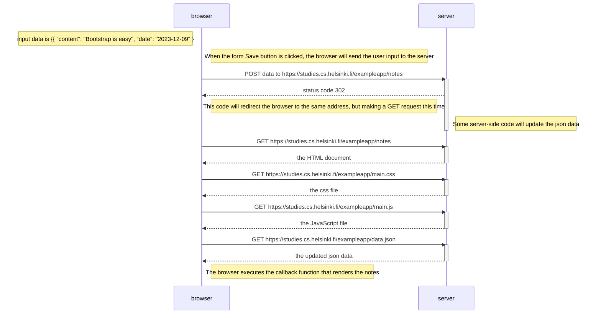

```mermaid
sequenceDiagram;
    participant B as browser
    participant S as server
    
    Note left of B: input data is {{ "content": "Bootstrap is easy", "date": "2023-12-09" }
    Note right of B: When the form Save button is clicked, the browser will send the user input to the server
    B->>S: POST data to https://studies.cs.helsinki.fi/exampleapp/notes
    activate S
    S-->>B: status code 302
    Note left of S: This code will redirect the browser to the same address, but making a GET request this time
    Note right of S: Some server-side code will update the json data 
    deactivate S
    B->>S: GET https://studies.cs.helsinki.fi/exampleapp/notes
    activate S
    S-->>B: the HTML document
    deactivate S
    
    B->>S: GET https://studies.cs.helsinki.fi/exampleapp/main.css
    activate S
    S-->>B: the css file
    deactivate S

    B->>S: GET https://studies.cs.helsinki.fi/exampleapp/main.js
    activate S
    S-->>B: the JavaScript file
    deactivate S

    B->>S: GET https://studies.cs.helsinki.fi/exampleapp/data.json
    activate S
    S-->>B: the updated json data
    deactivate S

    Note right of B: The browser executes the callback function that renders the notes
```
