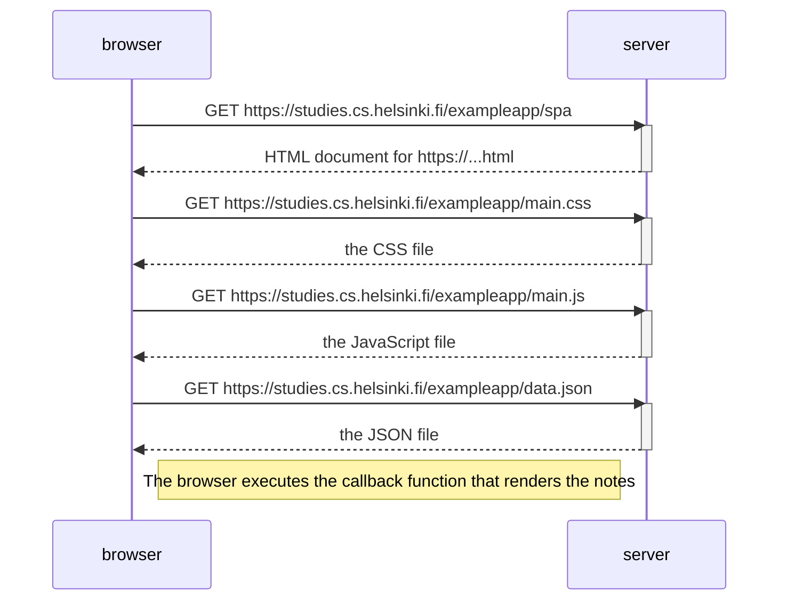

```mermaid
sequenceDiagram
    participant B as browser
    participant S as server

    B->>S: GET https://studies.cs.helsinki.fi/exampleapp/spa
    activate S
    S-->>B: HTML document for https://...html
    deactivate S

    B->>S: GET https://studies.cs.helsinki.fi/exampleapp/main.css
    activate S
    S-->>B: the CSS file
    deactivate S

    B->>S: GET https://studies.cs.helsinki.fi/exampleapp/main.js
    activate S
    S-->>B: the JavaScript file 
    deactivate S

    B->>S: GET https://studies.cs.helsinki.fi/exampleapp/data.json
    activate S
    S-->>B: the JSON file
    deactivate S

    Note right of B: The browser executes the callback function that renders the notes
```
