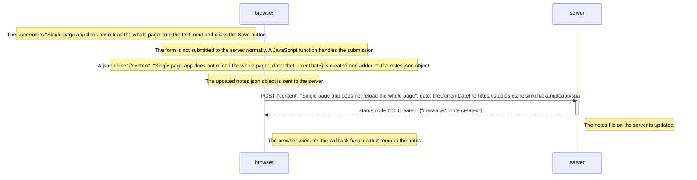

```mermaid
sequenceDiagram
    participant B as browser
    participant S as server

    Note left of B: The user enters "Single page app does not reload the whole page" into the text input and clicks the Save button

    Note over B: The form is not submitted to the server normally. A JavaScript function handles the submission

    Note over B: A json object {'content': "Single page app does not reload the whole page", date: theCurrentDate} is created and added to the notes json object.
    
    Note over B: The updated notes json object is sent to the server

    B->>S: POST {'content': "Single page app does not reload the whole page", date: theCurrentDate} to https://studies.cs.helsinki.fi/exampleapp/spa
    activate S
    S-->>B: status code 201 Created, {"message":"note created"}
    deactivate S

    Note right of S: The notes file on the server is updated. 

    Note right of B: The browser executes the callback function that renders the notes
```
